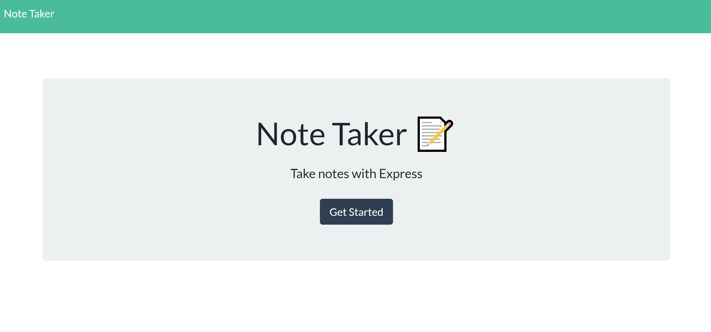
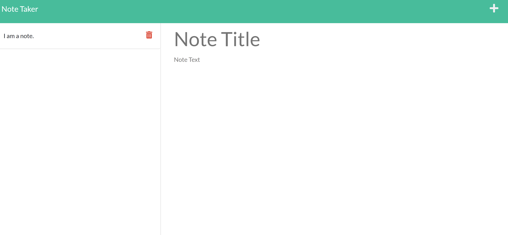
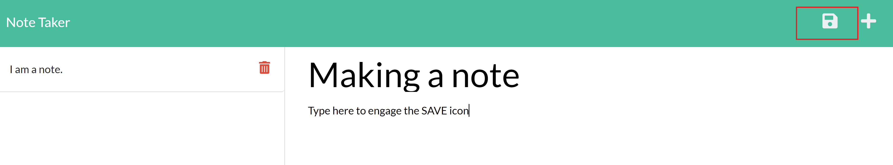
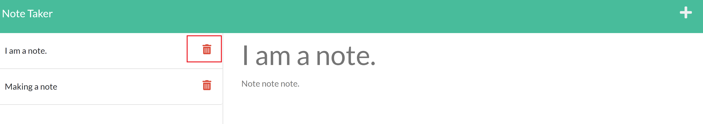

# M11-Note-Taker
## Live Site Link : https://noattakor.herokuapp.com/
</i>

### Click Get Started to see current notes or make new ones.
- </i>
- If you have a note currently opened in the note section, click the + sign to create a new note
- Once you click into the new note section and stary typing, you will see the "save" icon appear. Click this to save this note.
- </i>
- On the left side, click a saved note to view it. Or click the "Trash Can" icon to delete this note.
- </i>
    - That's pretty much it!

